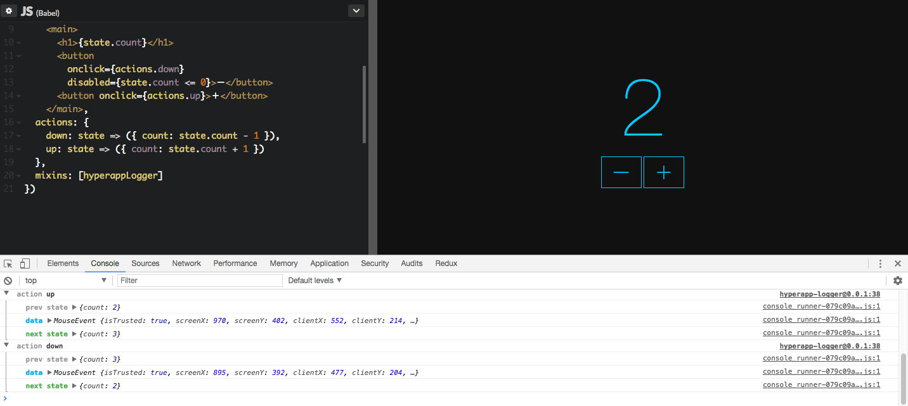

# hyperapp-logger

[](https://www.npmjs.com/package/hyperapp-logger)

A [HyperApp](https://github.com/hyperapp/hyperapp) [mixin](https://github.com/hyperapp/hyperapp/blob/master/docs/mixins.md) that logs state updates with the actions that caused them to the console. Heavily inspired by [redux-logger](https://github.com/evgenyrodionov/redux-logger).



## Install

### npm

```sh
npm install --save hyperapp-logger
```

### Yarn

```sh
yarn add hyperapp-logger
```

## Usage

### ES6 Node

```js
import logger from 'hyperapp-logger';
...
app({
  ...
  mixins: [logger()]
})
```

### ES5 Node

```js
const logger = require('hyperapp-logger');
...
app({
  ...
  mixins: [logger()]
})
```

## Options

If you wish to customize what the logger does, provide a `log` property in the optional options passed when creating it:

```js
mixins: [
  logger({
    log(prevState, action, nextState) {
      // format and send your log messages anywhere you like
    }
  })
]
```

### Browser

Because this package exports as UMD you can add it to an existing HTML/pen with the following script: `https://unpkg.com/hyperapp-logger` (For [CodePen](https://codepen.io) this is under Settings -> JavaScript -> Add External JavaScript). Then you just need to add the mixin to your app: `mixins: [hyperappLogger()]` and you'll be seeing logs! [Here](https://codepen.io/anon/pen/prOmqx?editors=0010) is an example of adding this logger to the ubiquitous counter Hyperapp sample.
